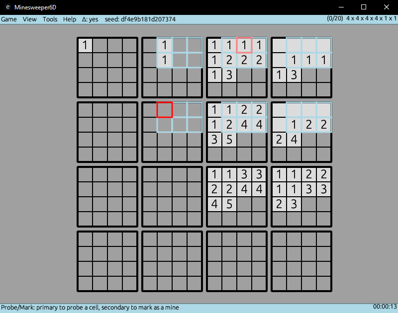
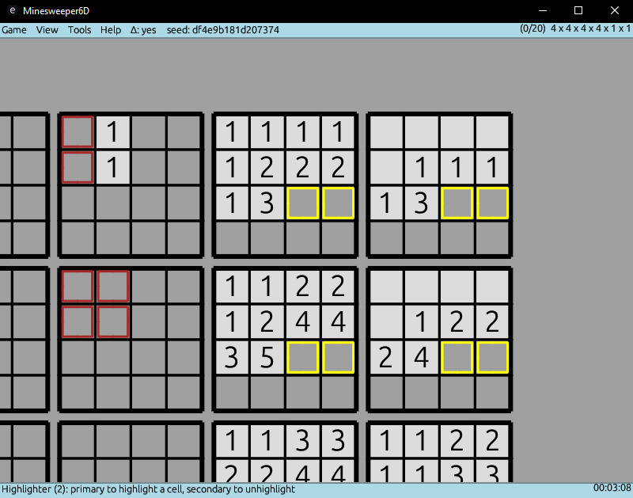

# minesweeper6d
Minesweeper in 6D written in safe Rust with:
- zoom & pan, various keyboard shortcuts
- 8 color highlighter with customizable colours
- deep game settings, including seeded game and wrapping (infinite) board
- option to create presets (several included by default)

